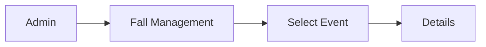
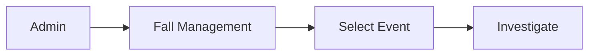
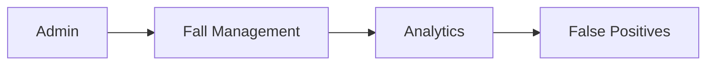
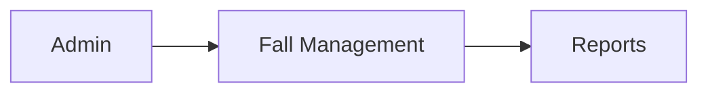
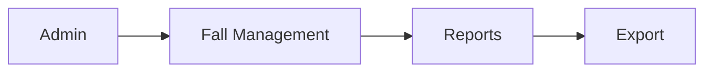

# Fall Management

Review and investigate fall events.

## Fall Events List

View all fall events:

`Admin → Fall Management → List Falls`

### Event Information

- Patient name
- Confidence level
- Date/time
- Location
- Status (investigated, pending, etc)

### Filters

Filter by:

- Confidence level
- Status
- Date range
- Patient
- Device

## Fall Details

View complete fall information:

Shows:

- Patient information
- Device that detected fall
- Confidence score
- Sensor data at time of fall
- Caregiver responses
- User comments

## Fall Investigation

Investigate suspicious fall events:

Options:

- Mark as legitimate fall
- Mark as false positive
- Request additional info from patient
- Notify caregiver
- Add notes/comments

### Investigation Workflow

1. Review sensor data
2. Check patient response
3. Review caregiver response
4. Determine if legitimate
5. Update status
6. Document findings

## False Positive Analysis

Track and analyze false positives:

Shows:

- False positive rate by device
- Common false positive patterns
- Recommendations for threshold adjustment

## Fall Reports

Generate fall reports:

Options:

- Falls by date range
- Falls by patient
- Falls by confidence level
- Falls by location
- Caregiver response times

### Export Reports

Export fall data:

Formats:

- PDF
- CSV
- JSON

## System Improvements

Use fall data to improve system:

1. **Threshold Tuning**: Adjust confidence thresholds
2. **Algorithm Updates**: Refine fall detection
3. **Pattern Analysis**: Identify common issues
4. **Device Optimization**: Improve sensor calibration

## Related Documentation

- [Admin Guide](/docs/admin-guide)
- [Fall Detection](/docs/iot-device/fall-detection)
- [API Reference - Admin](/docs/api-reference/admin)
