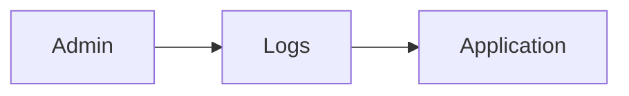
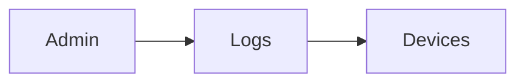
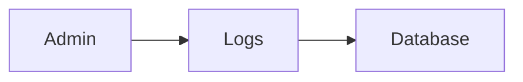
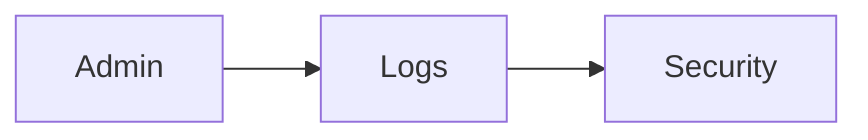
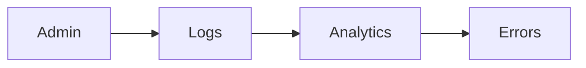
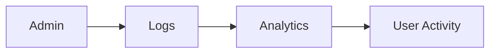
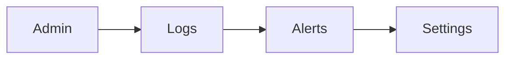
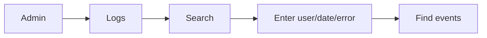
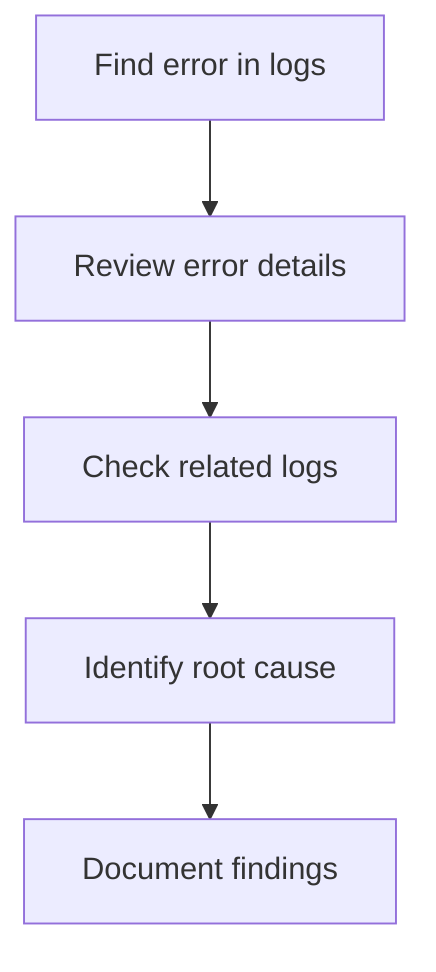
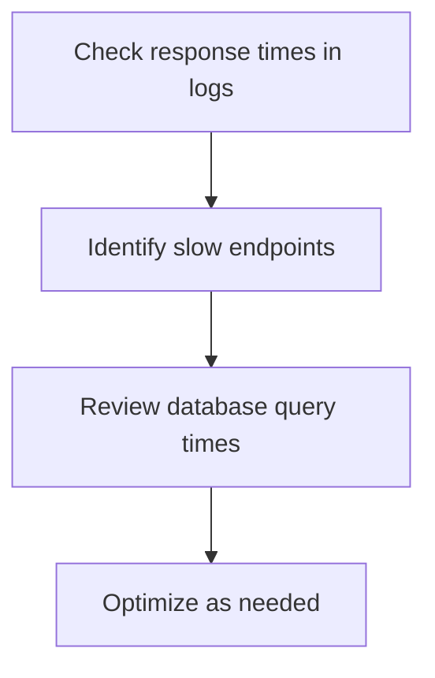

# System Logs

Access system logs for auditing and troubleshooting.

## Log Types

### Application Logs

Runtime information:



Levels:

- ERROR: Critical failures
- WARNING: Potential issues
- INFO: Normal operations
- DEBUG: Detailed diagnostics

### Access Logs

User authentication and access:


Shows:

- Login attempts (success/failure)
- Logout events
- API calls
- Permission denials

### Device Logs

Device activity:



Shows:

- Device connections
- Data submissions
- Errors
- Firmware updates

### Database Logs

Database operations:



Shows:

- Connection events
- Slow queries
- Errors
- Maintenance operations

### Security Logs

Security-related events:



Shows:

- Authentication failures
- Authorization denials
- Rate limit violations
- Suspicious activities

## Log Filters

Filter logs by:

- Date range
- Log level
- Component
- User
- IP address
- Error code

## Log Search

Search logs for specific events:


Examples:

- User login failures
- Device connection issues
- Slow database queries
- Specific error codes

## Log Analysis

### Performance Analysis


Shows:

- Average response times
- Slow endpoints
- Database performance
- API usage patterns

### Error Analysis



Shows:

- Error frequency
- Error types
- Affected endpoints
- Trends over time

### User Activity



Shows:

- Active users
- Login patterns
- Feature usage
- Anomalies

## Log Retention

Logs retained for:

- **Active logs**: 30 days (searchable)
- **Archive**: 90 days (downloadable)
- **Deleted**: After 90 days

### Data Retention Policy

Configure log retention:

```bash
LOG_RETENTION_DAYS=30
LOG_ARCHIVE_DAYS=90
LOG_DELETE_AFTER_DAYS=90
```

## Exporting Logs

Download logs for external analysis:


Formats:

- CSV
- JSON
- Syslog format

## Alerts & Notifications

Auto-alerts on:

- Multiple failed logins
- System errors
- Unusual activities
- Rate limit violations
- Database issues

### Configure Alerts



Options:

- Email notifications
- Alert thresholds
- Escalation rules

## Troubleshooting Guide

### Find Specific Event



### Investigate Errors



### Performance Issues



## Related Documentation

- [Admin Guide](/docs/admin-guide)
- [Deployment](/docs/deployment)
- [Troubleshooting](/docs/getting-started)
