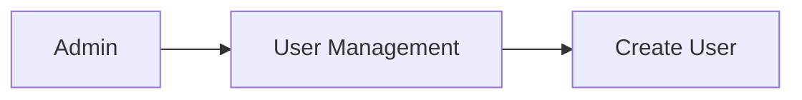
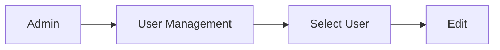
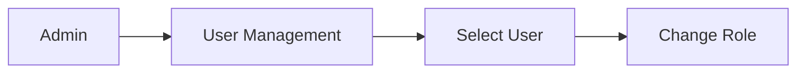
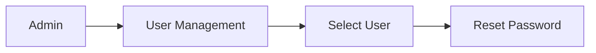
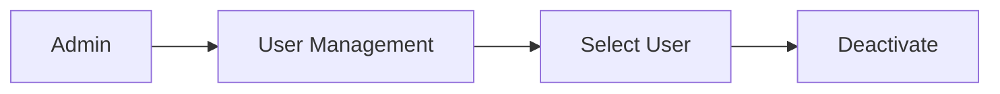
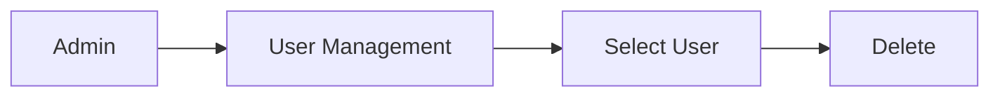
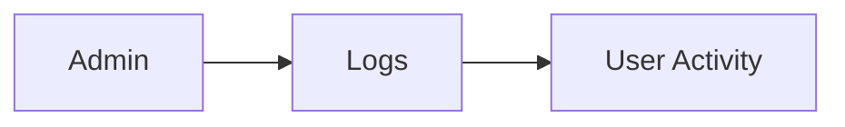

# User Management

Manage user accounts, roles, and permissions.

## User List

View all users in the system:

`Admin → User Management → List Users`

### User Information

- Email address
- Name (First/Last)
- Current role
- Status (active/inactive)
- Last login
- Created date

### Filters

Filter users by:

- Role (Patient, Caregiver, Admin)
- Status (active, inactive)
- Created date range
- Last login range

## Creating Users

Create new user account:

Form:

- Email (required)
- First Name (required)
- Last Name (required)
- Initial Role (Patient/Caregiver/Admin)
- Temporary Password (sent via email)

## Editing Users

Modify user account:

Can modify:

- Name
- Email (if not in use)
- Role
- Status

## Role Management

### Available Roles

**PATIENT**

- View own health data
- View own fall events
- Report falls
- No patient management

**CAREGIVER**

- View assigned patients
- Manage patient assignments
- View patient falls
- Acknowledge alerts

**ADMIN**

- Manage all users
- Manage all devices
- View all falls
- Access system logs
- Manage system settings

### Changing Roles

Note: Changing role immediately takes effect

## Resetting Passwords

Force password reset:

- Generates temporary password
- Sends email to user
- User must change on next login

## Deactivating Users

Deactivate user (without deletion):

Effects:

- Cannot login
- Sessions invalidated
- Data retained
- Can be reactivated

## Deleting Users

Permanently delete user account:

Warning: Cannot be undone!
Deletes:

- User account
- Sessions
- Patient/Caregiver profile
- Associated data (based on settings)

## User Activity

View user activity:

Shows:

- Login timestamps
- Actions performed
- Data accessed
- IP addresses

## Related Documentation

- [Admin Guide](/docs/admin-guide)
- [API Reference - Admin](/docs/api-reference/admin)
- [Authentication](/docs/architecture/auth-flow)
