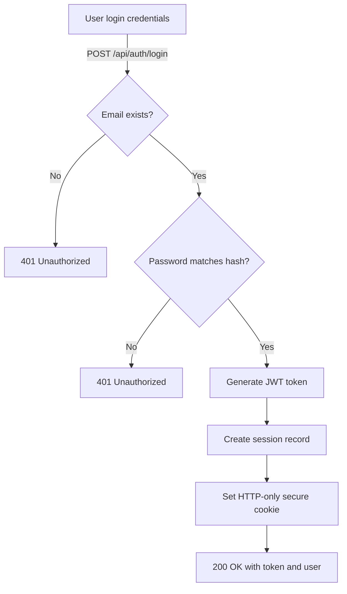
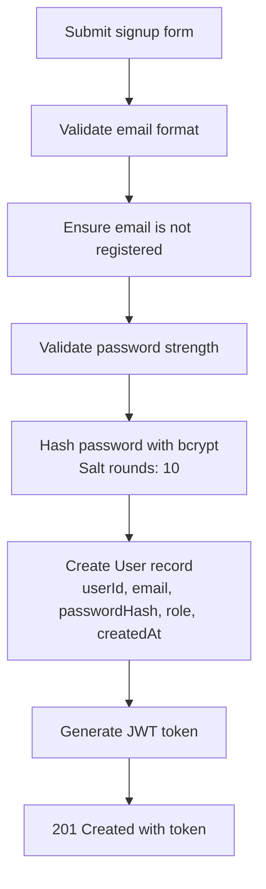

# Authentication Flow

SmartFall implements a secure, JWT-based authentication system with role-based access control (RBAC).

## Authentication Flow Diagram



## Registration Flow



## Login Process

### Step 1: Email Verification

```typescript
// Check if user exists
const user = await db.users.findByEmail(email);
if (!user) {
  return Response.json({ error: "Invalid credentials" }, { status: 401 });
}
```

### Step 2: Password Verification

```typescript
import bcryptjs from "bcryptjs";

const isPasswordValid = await bcryptjs.compare(
  plainPassword,
  user.passwordHash,
);

if (!isPasswordValid) {
  return Response.json({ error: "Invalid credentials" }, { status: 401 });
}
```

### Step 3: JWT Generation

```typescript
import * as jose from "jose";

const secret = new TextEncoder().encode(process.env.JWT_SECRET);
const token = await new jose.SignJWT({
  sub: user.id,
  email: user.email,
  role: user.role,
})
  .setProtectedHeader({ alg: "HS256" })
  .setIssuedAt()
  .setExpirationTime("24h")
  .sign(secret);
```

### Step 4: Session Creation

```typescript
// Create session record
await db.sessions.create({
  userId: user.id,
  token: token,
  expiresAt: new Date(Date.now() + 24 * 60 * 60 * 1000),
  ipAddress: request.headers.get("x-forwarded-for"),
  userAgent: request.headers.get("user-agent"),
});

// Set secure HTTP-only cookie
response.headers.set(
  "Set-Cookie",
  `session=${token}; HttpOnly; Secure; SameSite=Strict; Max-Age=86400`,
);
```

## JWT Token Structure

Standard JWT format with three parts: `header.payload.signature`

### Header

```json
{
  "alg": "HS256",
  "typ": "JWT"
}
```

### Payload (Claims)

```json
{
  "sub": "user_uuid",
  "email": "user@example.com",
  "role": "PATIENT",
  "iat": 1711000000,
  "exp": 1711086400
}
```

### Signature

```
HMACSHA256(
  base64UrlEncode(header) + "." +
  base64UrlEncode(payload),
  secret
)
```

## Token Verification

On each request, the token is verified:

```typescript
async function verifyToken(token: string): Promise<JWTPayload | null> {
  try {
    const secret = new TextEncoder().encode(process.env.JWT_SECRET);
    const verified = await jose.jwtVerify(token, secret);
    return verified.payload;
  } catch (error) {
    return null; // Invalid or expired token
  }
}
```

## Middleware Authentication

```typescript
// app/api/middleware.ts
export async function authMiddleware(request: Request) {
  // Extract token from Authorization header or cookie
  const token = extractToken(request);

  if (!token) {
    return Response.json({ error: "Unauthorized" }, { status: 401 });
  }

  // Verify token
  const payload = await verifyToken(token);

  if (!payload) {
    return Response.json({ error: "Invalid token" }, { status: 401 });
  }

  // Attach to request context
  request.user = payload;
  return null; // Continue to next handler
}
```

## Role-Based Access Control (RBAC)

### User Roles

| Role          | Permissions                           | Endpoints                                   |
| ------------- | ------------------------------------- | ------------------------------------------- |
| **PATIENT**   | View own data, report falls           | `/api/patients/me`, `/api/falls`            |
| **CAREGIVER** | View assigned patients, manage alerts | `/api/patients`, `/api/caregivers/patients` |
| **ADMIN**     | Full system access, user management   | `/api/admin/**`, all endpoints              |

### Authorization Decorator

```typescript
function requireRole(allowedRoles: Role[]) {
  return function (handler: RouteHandler) {
    return async (request: Request) => {
      const token = extractToken(request);
      const payload = await verifyToken(token);

      if (!payload) {
        return Response.json({ error: "Unauthorized" }, { status: 401 });
      }

      if (!allowedRoles.includes(payload.role)) {
        return Response.json({ error: "Forbidden" }, { status: 403 });
      }

      return handler(request, payload);
    };
  };
}
```

### Usage in Routes

```typescript
export const GET = requireRole(["ADMIN"])(async (request, user) => {
  // Only admins can access this
  const allUsers = await db.users.list();
  return Response.json(allUsers);
});
```

## Session Management

### Creating Sessions

Triggered on successful login:

```typescript
await db.sessions.create({
  userId: user.id,
  token,
  expiresAt: futureDate,
  ipAddress: clientIP,
  userAgent: clientUA,
  lastActivity: new Date(),
});
```

### Session Expiration

Tokens expire automatically:

- **Default**: 24 hours (configurable via `SESSION_DURATION`)
- **On expiration**: Client must re-authenticate

### Logout

```typescript
// POST /api/auth/logout
export async function POST(request: Request) {
  const token = extractToken(request);

  // Invalidate session
  await db.sessions.delete(token);

  // Clear cookie
  const response = Response.json({ success: true });
  response.headers.set("Set-Cookie", "session=; Max-Age=0");
  return response;
}
```

## Password Management

### Registration Password Validation

```typescript
function validatePassword(password: string): {
  valid: boolean;
  errors: string[];
} {
  const errors = [];

  if (password.length < 8) {
    errors.push("Minimum 8 characters");
  }
  if (!/[A-Z]/.test(password)) {
    errors.push("Must contain uppercase letter");
  }
  if (!/[a-z]/.test(password)) {
    errors.push("Must contain lowercase letter");
  }
  if (!/[0-9]/.test(password)) {
    errors.push("Must contain digit");
  }
  if (!/[!@#$%^&*]/.test(password)) {
    errors.push("Must contain special character");
  }

  return {
    valid: errors.length === 0,
    errors,
  };
}
```

### Password Reset Flow

1. User requests password reset
2. Email verification link sent
3. Link token has 30-minute expiration
4. User sets new password
5. All sessions invalidated (force re-login)

## Token Refresh

Optional refresh token mechanism:

```typescript
// POST /api/auth/refresh
export async function POST(request: Request) {
  const refreshToken = extractToken(request);

  // Verify refresh token (longer expiration)
  const payload = await verifyRefreshToken(refreshToken);

  if (!payload) {
    return Response.json({ error: "Unauthorized" }, { status: 401 });
  }

  // Generate new access token
  const newAccessToken = await generateToken(payload);

  return Response.json({ token: newAccessToken });
}
```

## Security Considerations

### HTTP Headers

```typescript
response.headers.set("X-Content-Type-Options", "nosniff");
response.headers.set("X-Frame-Options", "DENY");
response.headers.set("X-XSS-Protection", "1; mode=block");
response.headers.set("Strict-Transport-Security", "max-age=31536000");
```

### Cookie Configuration

- **HttpOnly**: Prevents JavaScript access
- **Secure**: Only over HTTPS
- **SameSite=Strict**: Prevents CSRF attacks
- **Max-Age**: Session duration

### Rate Limiting

Prevent brute force attacks:

```bash
RATE_LIMIT_WINDOW_MS=60000
RATE_LIMIT_MAX_REQUESTS=5  # per email per minute
```

## CORS & Cross-Origin

```typescript
// Allowed origins from environment
const allowedOrigins = process.env.ALLOWED_ORIGINS?.split(",") || [];

response.headers.set("Access-Control-Allow-Origin", allowedOrigins[0]);
response.headers.set("Access-Control-Allow-Credentials", "true");
```

## Related Documentation

- [API Reference - Auth](/docs/api-reference/auth)
- [Architecture Overview](/docs/architecture)
- [Getting Started](/docs/getting-started)
