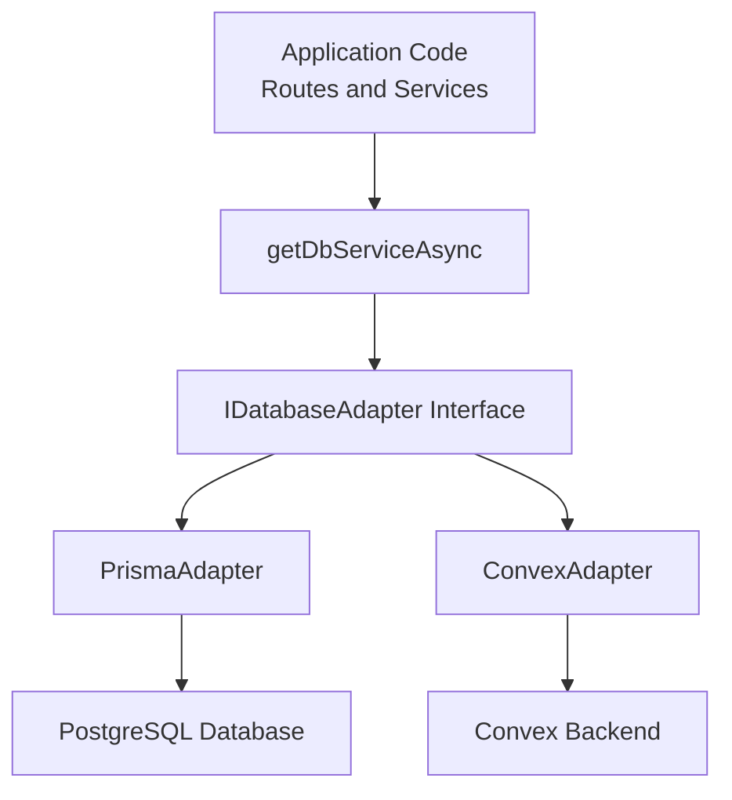

# Database Adapter Pattern

SmartFall implements the Adapter Pattern to support multiple database providers without changing application code. This architectural choice provides flexibility and future-proofs the system.

## Overview

The database adapter pattern abstracts all database operations through a single interface, allowing seamless switching between PostgreSQL (via Prisma) and Convex (serverless).

## Architecture



## IDatabaseAdapter Interface

The base interface defines 12 repository interfaces:

```typescript
interface IDatabaseAdapter {
  users: IUserRepository;
  sessions: ISessionRepository;
  patients: IPatientRepository;
  caregivers: ICaregiverRepository;
  devices: IDeviceRepository;
  sensorData: ISensorDataRepository;
  deviceStatus: IDeviceStatusRepository;
  deviceLogs: IDeviceLogRepository;
  falls: IFallRepository;
  caregiverPatients: ICaregiverPatientRepository;
  healthLogs: IHealthLogRepository;
  messages: IMessageRepository;
}
```

## Repository Interfaces

Each repository provides CRUD operations:

### IUserRepository

```typescript
interface IUserRepository {
  create(data: CreateUserData): Promise<User>;
  findById(id: string): Promise<User | null>;
  findByEmail(email: string): Promise<User | null>;
  update(id: string, data: UpdateUserData): Promise<User>;
  delete(id: string): Promise<boolean>;
}
```

### IPatientRepository

```typescript
interface IPatientRepository {
  create(data: CreatePatientData): Promise<Patient>;
  findById(id: string): Promise<Patient | null>;
  findByUserId(userId: string): Promise<Patient | null>;
  list(): Promise<Patient[]>;
  update(id: string, data: UpdatePatientData): Promise<Patient>;
  delete(id: string): Promise<boolean>;
}
```

Similar interfaces exist for all 10 models: Users, Sessions, Patients, Caregivers, Devices, SensorData, DeviceStatus, DeviceLogs, Falls, HealthLogs, Messages, and CaregiverPatients.

## Factory Pattern

The database service uses a factory to select the appropriate adapter:

```typescript
// lib/db/service.ts
async function getDbServiceAsync(): Promise<IDatabaseAdapter> {
  const provider = process.env.DATABASE_PROVIDER;

  if (provider === "convex") {
    return new ConvexAdapter();
  }

  return new PrismaAdapter();
}
```

## Usage in Routes

Application code doesn't know which database is being used:

```typescript
// app/api/patients/route.ts
export async function GET(request: Request) {
  const db = await getDbServiceAsync();

  // Works with Prisma OR Convex - no code changes needed
  const patients = await db.patients.list();

  return Response.json(patients);
}
```

## Adapter Implementations

### PrismaAdapter

Located in `lib/db/adapters/prisma/`:

- Uses Prisma Client for PostgreSQL/MySQL
- Supports complex queries and transactions
- Best for relational data with strong consistency

Key features:

- Type-safe queries
- Migration support
- Connection pooling
- Query optimization

### ConvexAdapter

Located in `lib/db/adapters/convex/`:

- Uses Convex SDK for serverless backend
- Real-time subscriptions built-in
- Schema-less flexibility
- Automatic scaling

Key features:

- Serverless deployment
- Real-time updates via WebSockets
- No infrastructure to manage
- Automatic backups

## Switching Providers

To switch from Prisma to Convex:

1. **Update .env.local**:

```bash
DATABASE_PROVIDER=convex
CONVEX_DEPLOYMENT=prod:your-deployment-id
```

2. **Restart the server**:

```bash
npm run dev
```

That's it! No code changes needed.

## Data Consistency

Both adapters maintain the same data model and constraints:

| Feature            | Prisma     | Convex          |
| ------------------ | ---------- | --------------- |
| ACID Transactions  | ✓          | ✓               |
| Foreign Keys       | ✓          | Schema-enforced |
| Unique Constraints | ✓          | ✓               |
| Validation         | Middleware | Validators      |
| Migrations         | Explicit   | Automatic       |

## Adding New Models

To add a new database model:

1. **Define the model schema** in both providers:
   - `prisma/schema.prisma` (Prisma)
   - `convex/schema.ts` (Convex)

2. **Create repository interface** in `lib/db/types.ts`:

```typescript
export interface IMyModelRepository {
  create(data: CreateData): Promise<MyModel>;
  findById(id: string): Promise<MyModel | null>;
  // ... other methods
}
```

3. **Implement in both adapters**:
   - `lib/db/adapters/prisma/myModel.ts`
   - `lib/db/adapters/convex/myModel.ts`

4. **Update IDatabaseAdapter** interface to include the new repository

5. **Use in application code**:

```typescript
const db = await getDbServiceAsync();
const item = await db.myModel.create(data);
```

## Performance Considerations

### Prisma

- Single query optimization for complex relationships
- Connection pooling for concurrent requests
- Query result caching possibilities

### Convex

- Real-time subscription overhead (if not used)
- Automatic scaling handles traffic spikes
- Lower initial deployment complexity

## Testing

Both adapters provide the same interface for unit testing:

```typescript
// Easy to mock for testing
const mockDb = {
  users: { findById: jest.fn() },
  patients: { list: jest.fn() },
  // ... other repositories
} as unknown as IDatabaseAdapter;

// Test code doesn't care which provider
const service = new UserService(mockDb);
```

## Migration Between Providers

To migrate data from Prisma to Convex:

1. Export data from Prisma:

```bash
npm run prisma:studio
```

2. Import into Convex backend

3. Verify data integrity

4. Update `DATABASE_PROVIDER` environment variable

5. Deploy with confidence - code doesn't change

## Design Benefits

1. **Flexibility**: Choose the right database for your needs
2. **Testability**: Easy to mock for unit tests
3. **Maintainability**: Changes in one adapter don't affect others
4. **Scalability**: Supports growth without code refactoring
5. **Future-proofing**: Easy to add new providers

## Related Documentation

- [Architecture Overview](/docs/architecture)
- [API Reference](/docs/api-reference)
- [Database Models](/docs/database/models)
- [IoT Pipeline](/docs/architecture/iot-pipeline)
