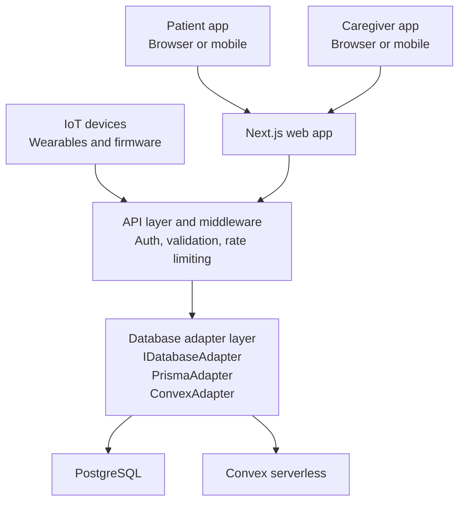
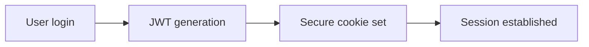
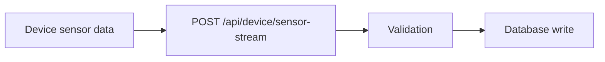
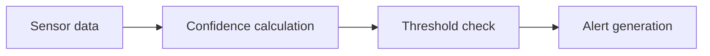
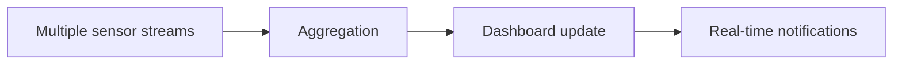

# System Architecture

SmartFall is built on a modern, scalable architecture designed for reliability, security, and performance. The system combines Next.js for the web application, REST APIs for IoT integration, and a flexible database adapter pattern.

## High-Level Overview

## Key Components

### 1. Client Layer

- **Web Application**: React-based Single Page Application (SPA)
- **Authentication**: JWT-based with secure session management
- **Responsive UI**: Mobile-first design using Tailwind CSS

### 2. Next.js Backend

- **Server-Side Rendering**: Optimized page delivery
- **API Routes**: RESTful endpoints in `/app/api`
- **Middleware**: Request processing and validation
- **Static Generation**: Pre-rendered documentation and public pages

### 3. IoT Integration

- **Device Communication**: HTTP POST for sensor data streams
- **MAC Address Normalization**: Standardized device identification
- **Real-time Processing**: Fall detection and vital monitoring

### 4. Database Adapter Pattern

Two database implementations available:

- **Prisma**: For PostgreSQL/MySQL deployments
- **Convex**: For serverless/real-time requirements

Switch providers via `DATABASE_PROVIDER` environment variable.

### 5. Authentication & Authorization

- **Role-Based Access Control (RBAC)**: Patient, Caregiver, Admin
- **JWT Tokens**: Stateless authentication
- **Session Management**: Secure cookie storage
- **Password Security**: bcrypt hashing with configurable rounds

## Technology Stack

| Layer              | Technology                         |
| ------------------ | ---------------------------------- |
| **Frontend**       | React 19, TypeScript, Tailwind CSS |
| **Framework**      | Next.js 16 with App Router         |
| **Authentication** | JWT, bcryptjs                      |
| **Database**       | PostgreSQL (Prisma) or Convex      |
| **ORM**            | Prisma or Convex SDK               |
| **API**            | REST, Next.js Route Handlers       |
| **Validation**     | TypeScript types                   |
| **UI Components**  | Radix UI, Lucide icons             |
| **Notifications**  | Toast notifications (Sonner)       |
| **Charts**         | Recharts                           |
| **Styling**        | Tailwind CSS, CSS Modules          |

## Data Flow

### 1. User Authentication

### 2. IoT Device Sensor Stream

### 3. Fall Detection

### 4. Patient Monitoring

## Scalability & Performance

- **Database Abstraction**: Easy provider switching without code changes
- **Stateless Design**: Horizontal scaling capability
- **Rate Limiting**: Protection against abuse
- **Caching**: Query optimization and data freshness
- **Asynchronous Operations**: Non-blocking I/O for responsiveness

## Security Measures

- **HTTPS/TLS**: Encrypted data transmission
- **CORS**: Cross-Origin Resource Sharing restrictions
- **JWT**: Stateless authentication tokens
- **Password Hashing**: bcrypt with salt rounds
- **Input Validation**: Request payload verification
- **Role-Based Access**: Endpoint authorization

## Sections

### Database Adapter Pattern

Learn how SmartFall abstracts database operations to support multiple providers.

### IoT Pipeline

Understand sensor data flow from devices to storage and analysis.

### Authentication Flow

Detailed explanation of user authentication and authorization.

## Design Principles

1. **Separation of Concerns**: Clear boundaries between layers
2. **DRY (Don't Repeat Yourself)**: Reusable components and utilities
3. **SOLID Principles**: Maintainable and testable code
4. **Security-First**: Protection at every layer
5. **Scalability**: Designed for growth and load distribution

## Related Documentation

- [API Reference](/docs/api-reference) - 48+ endpoints
- [Database](/docs/database) - Schema and models
- [IoT Device](/docs/iot-device) - Device integration
- [Deployment](/docs/deployment) - Production setup
