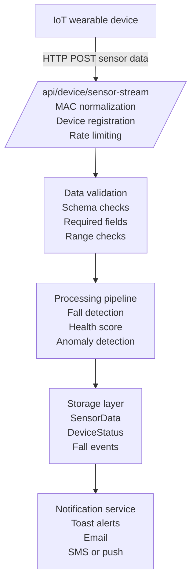

# IoT Pipeline

The IoT pipeline handles data flow from wearable devices through the SmartFall system for processing, analysis, and storage.

## Data Flow



## Sensor Stream Endpoint

**POST** `/api/device/sensor-stream`

### Request Payload

```json
{
  "device_id": "AA:BB:CC:DD:EE:FF",
  "accel_x": 0.5,
  "accel_y": 0.3,
  "accel_z": 9.8,
  "gyro_x": 0.1,
  "gyro_y": 0.2,
  "gyro_z": -0.05,
  "pressure": 101.3,
  "fsr": 0.45,
  "heart_rate": 72,
  "spo2": 98,
  "battery_level": 85.0,
  "wifi_connected": true,
  "bluetooth_connected": false,
  "sensors_initialized": true,
  "uptime_ms": 3600000
}
```

### Required Fields

| Field       | Type    | Description                                   |
| ----------- | ------- | --------------------------------------------- |
| `device_id` | string  | MAC address (normalized to AA:BB:CC:DD:EE:FF) |
| `accel_x`   | float   | Acceleration X-axis (m/s²)                    |
| `accel_y`   | float   | Acceleration Y-axis (m/s²)                    |
| `accel_z`   | float   | Acceleration Z-axis (m/s²)                    |
| `gyro_x`    | float   | Gyroscope X-axis (°/s)                        |
| `gyro_y`    | float   | Gyroscope Y-axis (°/s)                        |
| `gyro_z`    | float   | Gyroscope Z-axis (°/s)                        |
| `uptime_ms` | integer | Device uptime (milliseconds)                  |

### Optional Fields

| Field                 | Type    | Description                    |
| --------------------- | ------- | ------------------------------ |
| `pressure`            | float   | Atmospheric pressure (hPa)     |
| `fsr`                 | float   | Foot Pressure (0-1 normalized) |
| `heart_rate`          | integer | Heart rate (bpm)               |
| `spo2`                | integer | Blood oxygen (%)               |
| `battery_level`       | float   | Battery remaining (%)          |
| `wifi_connected`      | boolean | WiFi status                    |
| `bluetooth_connected` | boolean | Bluetooth status               |
| `sensors_initialized` | boolean | Sensor readiness               |

## Device Registration

First data submission automatically registers the device:

1. **MAC Normalization**: `aabbccddeeff` → `AA:BB:CC:DD:EE:FF`
2. **Device Creation**: Record created if not exists
3. **Association**: Device linked to authenticated user
4. **Initial Status**: Set device to "active"

## Rate Limiting

- **Maximum**: 1 record per second per device
- **Burst**: Up to 5 records queued
- **Exceeded**: Return HTTP 429 (Too Many Requests)

```typescript
// Example implementation
const lastTimestamp = deviceCache.get(deviceId);
const now = Date.now();

if (now - lastTimestamp < 1000) {
  return Response.json({ error: "Rate limit exceeded" }, { status: 429 });
}
```

## Fall Detection Algorithm

Falls are detected using acceleration and gyroscope data:

```typescript
function calculateFallConfidence(
  accel: { x; y; z },
  gyro: { x; y; z },
  previousData: SensorHistory,
): number {
  // 1. Calculate total acceleration
  const totalAccel = Math.sqrt(accel.x ** 2 + accel.y ** 2 + accel.z ** 2);

  // 2. Detect sudden acceleration drop (free fall phase)
  const accelChange = totalAccel - previousData.avgAccel;
  const freefall = accelChange < -5.0 ? 0.3 : 0;

  // 3. High rotation indicates tumbling
  const rotationRate = Math.sqrt(gyro.x ** 2 + gyro.y ** 2 + gyro.z ** 2);
  const tumbling = rotationRate > 500 ? 0.3 : 0;

  // 4. Vertical position change
  const verticalVelocity = accel.z - 9.8;
  const hasVerticalComponent = Math.abs(verticalVelocity) > 3.0 ? 0.2 : 0;

  // 5. Combine confidence scores
  const confidence = Math.min(freefall + tumbling + hasVerticalComponent, 1.0);
  return confidence;
}
```

### Confidence Levels

| Level      | Range       | Action             | Color    |
| ---------- | ----------- | ------------------ | -------- |
| NO_FALL    | 0.00 - 0.30 | None               | Green    |
| SUSPICIOUS | 0.31 - 0.50 | Log event          | Yellow   |
| POTENTIAL  | 0.51 - 0.70 | Alert caregiver    | Orange   |
| HIGH       | 0.71 - 0.89 | Notify + Alert     | Red      |
| CONFIRMED  | 0.90 - 1.00 | Emergency protocol | Dark Red |

## Response Handling

### Successful Submission

```json
HTTP/1.1 200 OK
{
  "success": true,
  "deviceId": "AA:BB:CC:DD:EE:FF",
  "timestamp": "2026-03-18T14:30:00Z",
  "fallDetected": false,
  "fallConfidence": 0.12,
  "nextAllowedRequest": "2026-03-18T14:30:01Z"
}
```

### Validation Error

```json
HTTP/1.1 400 Bad Request
{
  "error": "Invalid request",
  "details": {
    "accel_x": "Must be a number",
    "gyro_z": "Missing required field"
  }
}
```

### Rate Limited

```json
HTTP/1.1 429 Too Many Requests
{
  "error": "Rate limit exceeded",
  "retryAfter": 1000
}
```

## Health Score Calculation

Real-time health score from vital signs:

```typescript
function calculateHealthScore(
  heartRate: number,
  spo2: number,
  battery: number,
): number {
  let score = 100;

  // Heart rate range: 60-100 bpm is ideal
  if (heartRate < 60 || heartRate > 100) {
    score -= 10;
  }

  // Oxygen saturation: 95%+ is ideal
  if (spo2 < 95) {
    score -= Math.ceil((95 - spo2) * 2);
  }

  // Battery level affects reliability
  if (battery < 20) {
    score -= 15;
  }

  return Math.max(0, score);
}
```

## Anomaly Detection

System flags unusual patterns:

- **Repeated falls** within 1 hour
- **Elevated heart rate** sustained for 10+ minutes
- **Low oxygen saturation** below 90%
- **Device inactivity** for 30+ minutes

## Data Retention

Sensor data retention policy:

```bash
SENSOR_DATA_RETENTION_DAYS=90
```

- **Last 24 hours**: Full resolution (1 per second)
- **1-7 days**: 1-minute aggregates
- **7-90 days**: 1-hour aggregates
- **90+ days**: Deleted (archived separately)

## Bandwidth Optimization

For high-frequency sampling:

```typescript
// Batch multiple readings in single request
POST /api/device/sensor-stream/batch
{
  "device_id": "AA:BB:CC:DD:EE:FF",
  "readings": [
    { "accel_x": 0.5, "accel_y": 0.3, ... },
    { "accel_x": 0.6, "accel_y": 0.2, ... },
    // up to 100 readings
  ]
}
```

## Testing the Pipeline

### Curl Example

```bash
curl -X POST http://localhost:3000/api/device/sensor-stream \
  -H "Content-Type: application/json" \
  -H "Authorization: Bearer YOUR_TOKEN" \
  -d '{
    "device_id": "AA:BB:CC:DD:EE:FF",
    "accel_x": 0.5,
    "accel_y": 0.3,
    "accel_z": 9.8,
    "gyro_x": 0.1,
    "gyro_y": 0.2,
    "gyro_z": -0.05,
    "uptime_ms": 3600000
  }'
```

## Related Documentation

- [Sensor Stream Format](/docs/iot-device/sensor-stream-format)
- [Fall Detection](/docs/iot-device/fall-detection)
- [API Reference](/docs/api-reference/device)
- [Architecture Overview](/docs/architecture)
