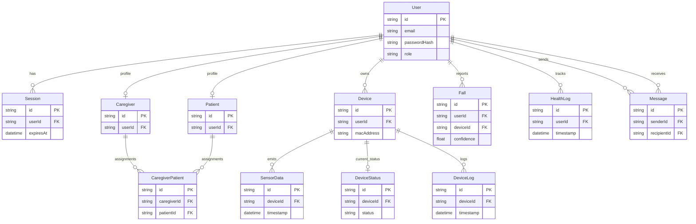

# Schema Overview

Entity Relationship Diagram for SmartFall database.

## ER Diagram



## Key Relationships

### One-to-Many

- **User → Session**: One user has many login sessions
- **User → Patient**: One user has one patient profile (if PATIENT role)
- **User → Caregiver**: One user has one caregiver profile (if CAREGIVER role)
- **User → Device**: One user has multiple devices
- **User → Fall**: One user has multiple fall events
- **Device → SensorData**: One device has many sensor readings
- **Device → DeviceStatus**: One device has one current status
- **Device → DeviceLog**: One device has many activity logs
- **User → HealthLog**: One user has many health records
- **User → Message**: One user sends/receives many messages

### Many-to-Many

- **Caregiver ↔ Patient**: Implemented via CaregiverPatient junction table

## Index Strategy

Indexes optimize common queries:

| Table      | Indexed Columns           | Purpose                |
| ---------- | ------------------------- | ---------------------- |
| User       | email                     | Login lookups          |
| Patient    | userId                    | Find patient by user   |
| Caregiver  | userId                    | Find caregiver by user |
| Device     | userId, macAddress        | Device lookups         |
| SensorData | deviceId, timestamp       | Time-series queries    |
| Fall       | userId, status, timestamp | Fall event filtering   |
| DeviceLog  | deviceId, timestamp       | Activity tracking      |
| Message    | senderId, recipientId     | Conversation retrieval |

## Data Consistency

### Cascade Behaviors

| Action           | Behavior                                                               |
| ---------------- | ---------------------------------------------------------------------- |
| Delete User      | Cascade: Sessions, Patient/Caregiver profile, Devices, Falls, Messages |
| Delete Device    | Cascade: SensorData, DeviceStatus, DeviceLogs                          |
| Delete Caregiver | Update: CaregiverPatient (set to NULL)                                 |

### Constraints

- Email is unique per User
- MAC address is unique per Device
- User can have only one Patient and one Caregiver profile
- Device must have an owner (userId)
- CaregiverPatient requires valid caregiver and patient IDs

## Query Patterns

### Find Patient's Devices

```sql
SELECT d.* FROM devices d
WHERE d.user_id = $1
```

### Get Recent Sensor Data

```sql
SELECT s.* FROM sensor_data s
WHERE s.device_id = $1
  AND s.timestamp > $2
ORDER BY s.timestamp DESC
```

### List High-Risk Patients for Caregiver

```sql
SELECT p.* FROM patients p
JOIN caregiver_patients cp ON p.id = cp.patient_id
WHERE cp.caregiver_id = $1
  AND p.risk_score >= 75
```

### Get Unread Messages

```sql
SELECT m.* FROM messages m
WHERE m.recipient_id = $1
  AND m.read = false
ORDER BY m.created_at DESC
```

## Related Documentation

- [Database Models](/docs/database/models)
- [Architecture - Database Adapter Pattern](/docs/architecture/database-adapter-pattern)
