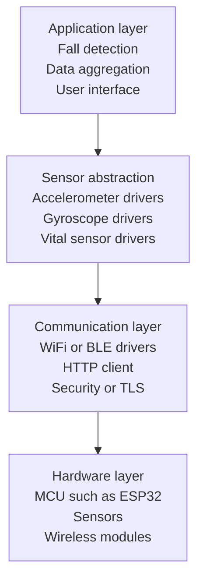

# Firmware Guide

Guide for developing firmware for SmartFall devices.

## Firmware Architecture



## Sensor Integration

### Accelerometer (MPU-6050 Example)

```cpp
#include <MPU6050.h>

MPU6050 mpu;

void initAccelerometer() {
  mpu.initialize();
  mpu.setAccelerometerPowerManagementMode(false);
  mpu.setFullScaleAccelerometerRange(MPU6050_ACCEL_FS_8);  // ±8g
}

void readAccelerometerData(float& x, float& y, float& z) {
  int16_t rawX, rawY, rawZ;
  mpu.getAccelerationData(rawX, rawY, rawZ);

  // Convert to m/s² (8g range = 0.00061 m/s² per LSB)
  x = rawX * 0.00061;
  y = rawY * 0.00061;
  z = rawZ * 0.00061;
}
```

### Gyroscope Integration

```cpp
void readGyroscopeData(float& x, float& y, float& z) {
  int16_t rawX, rawY, rawZ;
  mpu.getRotationData(rawX, rawY, rawZ);

  // Convert to °/s (250°/s range = 0.0076 °/s per LSB)
  x = rawX * 0.0076;
  y = rawY * 0.0076;
  z = rawZ * 0.0076;
}
```

### Heart Rate Sensor (Example)

```cpp
#include <MAX30102.h>

MAX30102 heartSensor;

void initHeartSensor() {
  heartSensor.begin();
  heartSensor.setSampleRate(100);  // 100 Hz
  heartSensor.setFifoThreshold(32);
}

void readHeartRate(int& bpm) {
  if (heartSensor.available()) {
    uint32_t ir = heartSensor.getIR();
    bpm = calculateHeartRate(ir);
  }
}
```

## WiFi Communication

```cpp
#include <WiFi.h>
#include <HTTPClient.h>

void connectWiFi(const char* ssid, const char* password) {
  WiFi.mode(WIFI_STA);
  WiFi.begin(ssid, password);

  int attempts = 0;
  while (WiFi.status() != WL_CONNECTED && attempts < 20) {
    delay(500);
    Serial.print(".");
    attempts++;
  }

  if (WiFi.status() == WL_CONNECTED) {
    Serial.println("\nWiFi connected!");
  } else {
    Serial.println("\nWiFi connection failed!");
  }
}

bool sendSensorData(const char* serverUrl, const char* token) {
  HTTPClient http;

  http.begin(serverUrl);
  http.addHeader("Authorization", String("Bearer ") + token);
  http.addHeader("Content-Type", "application/json");

  String payload = buildJsonPayload();
  int code = http.POST(payload);

  http.end();

  return code == 200;
}
```

## Data Buffering

Offline data buffering:

```cpp
#define BUFFER_SIZE 100

struct SensorReading {
  float accelX, accelY, accelZ;
  float gyroX, gyroY, gyroZ;
  int heartRate;
  uint32_t timestamp;
};

SensorReading buffer[BUFFER_SIZE];
int bufferIndex = 0;

void addToBuffer(const SensorReading& reading) {
  if (bufferIndex < BUFFER_SIZE) {
    buffer[bufferIndex++] = reading;
  }
}

void flushBuffer() {
  for (int i = 0; i < bufferIndex; i++) {
    sendSensorData(buffer[i]);
  }
  bufferIndex = 0;
}
```

## Power Optimization

```cpp
// Deep sleep for power conservation
void goToDeepSleep(uint64_t microseconds) {
  // Save state before sleep
  saveSessionData();

  // Enter deep sleep
  esp_sleep_enable_timer_wakeup(microseconds);
  esp_deep_sleep_start();
}

// Light sleep
void lightSleep(uint32_t milliseconds) {
  vTaskDelay(pdMS_TO_TICKS(milliseconds));
}
```

## Memory Management

Handle limited device memory:

```cpp
#define LOW_MEMORY_THRESHOLD 1000  // bytes

void checkMemory() {
  uint32_t freeHeap = esp_get_free_heap_size();

  if (freeHeap < LOW_MEMORY_THRESHOLD) {
    // Flush buffers to free memory
    flushBuffer();

    // Stop non-critical functions
    pauseDataCollection();
  }
}
```

## Firmware Update Process

### OTA (Over-The-Air) Update

```cpp
#include <Update.h>

bool performOTA(const char* updateUrl) {
  HTTPClient http;
  http.begin(updateUrl);

  int code = http.GET();
  if (code != 200) return false;

  int contentLength = http.getSize();
  if (!Update.begin(contentLength)) {
    return false;
  }

  WiFiClient stream = http.getStream();
  Update.writeStream(stream);

  if (!Update.end()) {
    return false;
  }

  // Restart to apply update
  ESP.restart();
  return true;
}
```

## Logging

Firmware logging for debugging:

```cpp
void logEvent(const char* level, const char* message) {
  time_t now = time(nullptr);
  struct tm* timeinfo = localtime(&now);

  Serial.printf("[%s] %s - %s\n",
    level,
    asctime(timeinfo),
    message
  );
}

#define LOG_INFO(msg) logEvent("INFO", msg)
#define LOG_ERROR(msg) logEvent("ERROR", msg)
#define LOG_DEBUG(msg) logEvent("DEBUG", msg)
```

## Configuration Management

Store device configuration:

```cpp
#include <EEPROM.h>

struct DeviceConfig {
  char deviceId[20];
  char wifiSSID[32];
  char wifiPassword[32];
  char serverUrl[128];
  char jwtToken[256];
  uint8_t sampleRate;
};

void saveConfig(const DeviceConfig& config) {
  EEPROM.writeBytes(0, (uint8_t*) &config, sizeof(config));
  EEPROM.commit();
}

void loadConfig(DeviceConfig& config) {
  EEPROM.readBytes(0, (uint8_t*) &config, sizeof(config));
}
```

## Testing Firmware

### Unit Testing

```cpp
void testAccelerometer() {
  float x, y, z;
  readAccelerometerData(x, y, z);

  assert(x >= -50.0 && x <= 50.0);
  assert(y >= -50.0 && y <= 50.0);
  assert(z >= -50.0 && z <= 50.0);

  Serial.println("Accelerometer test passed");
}
```

### Integration Testing

```cpp
void testDataCollection() {
  // Collect 100 samples
  for (int i = 0; i < 100; i++) {
    collectSensorData();
    delay(100);
  }

  // Verify buffer is populated
  assert(bufferIndex == 100);

  Serial.println("Data collection test passed");
}
```

## Best Practices

1. **Error Handling**: Check return values, implement retry logic
2. **Watchdog**: Enable watchdog timer to recover from hangs
3. **Logging**: Log important events for debugging
4. **Versioning**: Include firmware version in all communications
5. **Security**: Use TLS for HTTPS, validate certificates
6. **Testing**: Test before deploying to production
7. **Documentation**: Document sensor calibration values

## Common Issues

### Connection Failures

- Verify WiFi credentials
- Check signal strength
- Implement exponential backoff for retries

### Sensor Drift

- Implement regular recalibration
- Use high-quality sensors
- Implement software filters

### Memory Leaks

- Monitor heap usage
- Implement buffer limits
- Properly free resources

## Related Documentation

- [IoT Device Integration](/docs/iot-device)
- [Sensor Stream Format](/docs/iot-device/sensor-stream-format)
- [Device Status](/docs/iot-device/device-status)
