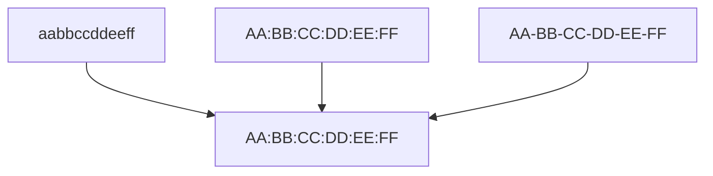

# Sensor Stream Format

Complete specification for the `/api/device/sensor-stream` JSON payload.

## Request Format

**Endpoint**: `POST /api/device/sensor-stream`
**Content-Type**: `application/json`
**Authentication**: Bearer token required

## Complete Payload

```json
{
  "device_id": "AA:BB:CC:DD:EE:FF",
  "accel_x": 0.5,
  "accel_y": 0.3,
  "accel_z": 9.8,
  "gyro_x": 0.1,
  "gyro_y": 0.2,
  "gyro_z": -0.05,
  "uptime_ms": 3600000,
  "pressure": 101.3,
  "fsr": 0.45,
  "heart_rate": 72,
  "spo2": 98,
  "battery_level": 85.0,
  "wifi_connected": true,
  "bluetooth_connected": false,
  "sensors_initialized": true
}
```

## Field Documentation

### Required Fields

#### device_id

- **Type**: String
- **Format**: MAC address `AA:BB:CC:DD:EE:FF`
- **Notes**: Automatically normalized on server
- **Example**: `"AA:BB:CC:DD:EE:FF"`

#### accel_x, accel_y, accel_z

- **Type**: Float
- **Unit**: m/s² (meters per second squared)
- **Range**: Typically -50 to +50
- **Notes**: Triaxial acceleration
- **Example**: `0.5, 0.3, 9.8`

#### gyro_x, gyro_y, gyro_z

- **Type**: Float
- **Unit**: °/s (degrees per second)
- **Range**: Typically -1000 to +1000
- **Notes**: Triaxial angular velocity
- **Example**: `0.1, 0.2, -0.05`

#### uptime_ms

- **Type**: Integer
- **Unit**: Milliseconds
- **Range**: 0 to 2^32-1
- **Notes**: Device uptime since boot
- **Example**: `3600000` (1 hour)

### Optional Fields

#### pressure

- **Type**: Float
- **Unit**: hPa (hectopascals)
- **Range**: Typically 900-1100
- **Notes**: Atmospheric/environmental pressure
- **Default**: Null

#### fsr

- **Type**: Float
- **Unit**: Normalized (0-1)
- **Range**: 0.0 to 1.0
- **Notes**: Foot Pressure Reading (for foot sensors)
- **Default**: Null

#### heart_rate

- **Type**: Integer
- **Unit**: bpm (beats per minute)
- **Range**: 40-200
- **Notes**: Cardiac activity
- **Default**: Null

#### spo2

- **Type**: Integer
- **Unit**: % (percentage)
- **Range**: 70-100
- **Notes**: Blood oxygen saturation
- **Default**: Null

#### battery_level

- **Type**: Float
- **Unit**: % (percentage)
- **Range**: 0.0 to 100.0
- **Notes**: Device battery remaining
- **Default**: Null

#### wifi_connected

- **Type**: Boolean
- **Notes**: WiFi connection status
- **Default**: Null

#### bluetooth_connected

- **Type**: Boolean
- **Notes**: Bluetooth/BLE connection status
- **Default**: Null

#### sensors_initialized

- **Type**: Boolean
- **Notes**: All sensors ready and calibrated
- **Default**: Null

## Validation Rules

| Field         | Validation                | Error Code |
| ------------- | ------------------------- | ---------- |
| device_id     | Valid MAC format          | 400        |
| accel\_\*     | Numeric, reasonable range | 400        |
| gyro\_\*      | Numeric, reasonable range | 400        |
| uptime_ms     | Positive integer          | 400        |
| heart_rate    | 40-200 if present         | 400        |
| spo2          | 70-100 if present         | 400        |
| battery_level | 0-100 if present          | 400        |

## MAC Address Normalization

Device IDs are automatically normalized:



## Response Format

### Success Response

```json
{
  "success": true,
  "data": {
    "deviceId": "AA:BB:CC:DD:EE:FF",
    "timestamp": "2026-03-18T10:30:00Z",
    "fallDetected": false,
    "fallConfidence": 0.12,
    "healthScore": 95,
    "nextAllowedRequest": "2026-03-18T10:30:01Z"
  }
}
```

### Error Response

```json
{
  "success": false,
  "error": "Validation failed",
  "details": {
    "accel_x": "Must be a number",
    "heart_rate": "Must be between 40 and 200"
  }
}
```

## Rate Limiting

- **Limit**: 1 request per second per device
- **Burst**: Up to 5 requests queued
- **Status Code**: 429 Too Many Requests

```json
{
  "success": false,
  "error": "Rate limit exceeded",
  "retryAfter": 1000
}
```

## Data Type Conversions

### Integers

```javascript
// Ensure integer values
const heartRate = Math.floor(72.4); // → 72
const spo2 = Math.round(98.5); // → 99
```

### Floats

```javascript
// Maintain precision for sensor readings
const accelX = parseFloat("0.5"); // → 0.5
const battery = parseFloat("85.0"); // → 85.0
```

### Booleans

```javascript
// Explicit boolean conversion
const wifiConnected = true; // ✓
const sensorInit = Boolean(1); // ✓ but use explicit true/false
```

## Example Requests

### Minimal Request

```bash
curl -X POST http://localhost:3000/api/device/sensor-stream \
  -H "Authorization: Bearer TOKEN" \
  -H "Content-Type: application/json" \
  -d '{
    "device_id": "AA:BB:CC:DD:EE:FF",
    "accel_x": 0.5,
    "accel_y": 0.3,
    "accel_z": 9.8,
    "gyro_x": 0.1,
    "gyro_y": 0.2,
    "gyro_z": -0.05,
    "uptime_ms": 3600000
  }'
```

### Full Request with Vitals

```bash
curl -X POST http://localhost:3000/api/device/sensor-stream \
  -H "Authorization: Bearer TOKEN" \
  -H "Content-Type: application/json" \
  -d '{
    "device_id": "AA:BB:CC:DD:EE:FF",
    "accel_x": 0.5,
    "accel_y": 0.3,
    "accel_z": 9.8,
    "gyro_x": 0.1,
    "gyro_y": 0.2,
    "gyro_z": -0.05,
    "uptime_ms": 3600000,
    "heart_rate": 72,
    "spo2": 98,
    "battery_level": 85.0,
    "pressure": 101.3,
    "fsr": 0.45,
    "wifi_connected": true,
    "bluetooth_connected": false,
    "sensors_initialized": true
  }'
```

## Batch Submission

Submit multiple readings in one request:

```bash
curl -X POST http://localhost:3000/api/device/sensor-stream/batch \
  -H "Authorization: Bearer TOKEN" \
  -H "Content-Type: application/json" \
  -d '{
    "device_id": "AA:BB:CC:DD:EE:FF",
    "readings": [
      { "accel_x": 0.5, "accel_y": 0.3, "accel_z": 9.8, ... },
      { "accel_x": 0.6, "accel_y": 0.2, "accel_z": 9.7, ... },
      { "accel_x": 0.4, "accel_y": 0.4, "accel_z": 9.9, ... }
    ]
  }'
```

## Timestamp Precision

Timestamps are server-generated from when the request is received:

```json
{
  "timestamp": "2026-03-18T10:30:00.123Z"
}
```

For accurate time correlation, include a client-side timestamp:

```json
{
  "device_id": "...",
  "client_timestamp": "2026-03-18T10:30:00Z",
  "accel_x": 0.5,
  "..."
}
```

## Related Documentation

- [IoT Device Integration](/docs/iot-device)
- [Fall Detection](/docs/iot-device/fall-detection)
- [API Reference - Devices](/docs/api-reference/devices)
